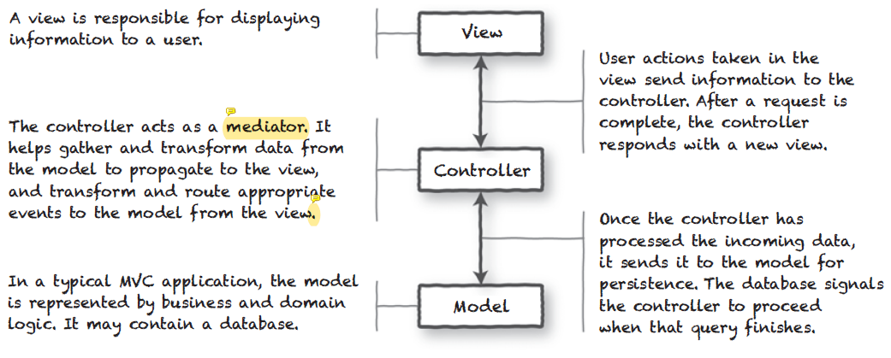
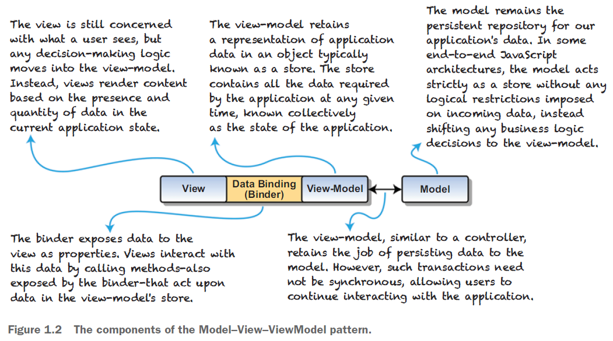

# Ch01 Introducing Vue.js

> **本章重点**
>
> - MVC 与 MVVM 设计模式
> - 响应式应用程序的定义
> - 描述 Vue 的生命周期
> - Vue.js 设计理念的评价

本章开篇先介绍了交互式网站的发展历程，以及随着 **Web 2.0** 时代的到来，**社交媒体** 和 **用户生成内容** 的兴起，如何推动交互式网站的发展。

开发人员需要跟上这些变化，让终端用户获得更多的 **互动体验**。随着时间的推移，**客户端框架** 和 **库** 被创建出来。**Vue.js** 是一个轻量级的库，可以轻松地添加到任何项目中，并能在任何 `JavaScript` 环境中添加交互功能。

本书主要面向具有一定 `JavaScript` 熟练度和对 `HTML` 和 `CSS` 有正确认知的 Web 开发人员，同时也适用于任何想要构建原型或个人项目应用的人。

本书将探讨如何使用 Vue 和其支持的库来构建完整、复杂的 Web 应用程序，并介绍如何将每个章节的代码融入到更大的项目中。

## 1.1. On the shoulders of giants 站在巨人的肩膀上

### 1）MVC 模式

尽管随着时间的推移，经典的 MVC 设计模式发生了变化，但现代 Web 应用程序开发框架仍然使用了该模式的变体——出现了 **客户端 MVC** 模式。

> **关于业务逻辑的位置**
>
> 上图提到，业务逻辑通常出现在 **Model** 层，但作者也用邮政编码为例，阐述了业务逻辑也可能出现在视图层（提交表单前的校验逻辑）、控制器层（后端接收请求参数时必要的校验逻辑）以及数据库层（以约束形式体现的业务逻辑（虽然强烈不推荐，也是一个可能出现的地方））。这个逻辑通常都在一次请求内完成，很难固定在某一位置。

MVC 模式的核心，是 **将应用程序的不同方面分离开**：

- **View** 视图：负责向用户显示信息
- **Controller** 控制器：负责在视图和模型之间传递事件和数据
- **Model** 模型：包含业务逻辑和数据存储。

该模式的缺点也很明显：每个请求都需要从客户端到服务器再到数据库，这个过程 **时间和资源消耗较大**，用户体验不佳。

为了提高 Web 应用程序的互动性，开发人员使用 **异步 Web 请求** 和 **客户端 MVC** 技术，使请求不会阻塞，并且执行不需要等待服务器响应。但是，这种方法仍然会使应用程序感觉迟缓或不稳定。

### 2） MVVM 模式

利用 `JavaScript` 异步编程技术，Web 应用不再需要请求完整的 Web 页面，而是可以通过 **部分更新视图** 来更快地响应。然而这种方法伴随着一定程度的重复劳动，因为展示逻辑通常也是业务逻辑的写照。

为此，引入 **MVVM 模式**（**Model-View-ViewModel**），全新引入的 **视图模型** 的概念，分别与数据层和视图层绑定，让用户交互和反馈更加便捷，同时也避免了整体架构中代码和逻辑的冗余。**视图模型** 的数据变化将自动更新任何与其绑定的 **视图**；数据绑定暴露了数据，一旦数据变化，视图也会随之更新：

从上图可以得出如下结论：

- 业务逻辑统一迁移到了 **VM**（视图模型层）；
- 视图模型（**View-Model**）会使用一个 **对象** 来保存应用程序的数据，该对象又称 **store**（即存储、数据仓库）。**store** 中包含应用程序在任何给定时间所需的所有数据（即应用程序的 **状态**）；
- **Vue** 的数据绑定机制，通常以 **property** 属性的方式暴露 **数据** 供视图渲染呈现，也会以 **method** 方法的形式暴露给 **VM**，以供其操作数据。

### 3）响应式应用程序

响应式应用的提法由来已久，只是最近才被开发 Web 应用的圈子唆广泛接受，这得益于 **Vue**、**React** 以及 **Angular** 等 JS 框架的大范围推广应用。

主要特点：

- 观察（Observe）应用程序状态的变化
- 在整个应用程序中传播并通知该变化
- 在应用程序的状态发生变化时，自动渲染视图
- 提供及时的用户交互反馈

实现这些特点的方式：

- 应用 **MVVM** 模式；
- **JS** 异步编程技术；
- 尽可能多地应用 **函数式编程** 范式。

### 4）简易计算器案例：原生 JS vs Vue.js 对比

## 1.2. Why Vue.js? 为何使用 Vue.js？

## 1.3. Future thoughts 展望未来

