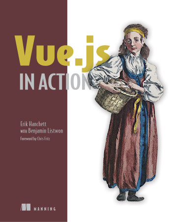

# 《Vue.js in Action》Learning Notes


## 1. Profiles



|    **Title**    | **Vue.js in Action** [ISBN: 9781617294624] |
| :-------------: | :----------------------------------------: |
|   **Author**    |  **Erik Hanchett with Benjamin Listwon**   |
| **Publication** |            **Manning, 2018.9**             |
|    **Pages**    |                  **304**                   |

> **Introduction**
>
> Web pages are rich with data and graphics, and it's challenging to maintain a smooth and quick user experience. *Vue.js in Action* teaches you how to build a fast, flowing web UI with the Vue.js framework. As you move through the book, you'll put your skills to practice by building a complete web store application with product listings, a checkout process, and an administrative interface.
>
> **about the technology**
>
> Vue.js is a lightweight frontend framework, offering easy two-way data binding, a reactive UI, and a common-sense project structure. It uses UI patterns and modern HTML to deliver impossibly fast page loads and silky smooth transitions—all from a tiny code footprint. It’s a delight to develop in Vue using ordinary JavaScript and its integrated Vuex state management tool.
>
> **about the book**
>
> *Vue.js in Action* is your guide to building modern web apps. You’ll start by exploring the reactive UI model while you get comfortable with Vue’s unique features. Then, you’ll go deeper as you build a shopping cart with an admin interface and the ability to manage stock! Finally, you’ll extend your app, adding transitions, tests, and other key features until it’s production ready.
>
> **what's inside**
>
> - Clearly annotated code and illustrations
> - Modeling data and consuming APIs
> - Easy state management with Vuex
> - Creating custom directives
>
> **about the reader**
>
> Written for web developers with some experience in JavaScript, HTML, and CSS.
>
> **about the authors**
>
> **Erik Hanchett** and **Benjamin Listwon** are experienced web engineers and fearless explorers of new ideas.


## 2. Outlines

Status available：:heavy_check_mark: (Completed) | :hourglass_flowing_sand: (Working) | :no_entry: (Not Started) | :orange_book: (Finish reading)

| No.  |                      Chapter Title                      |          Status          |
| :--: | :-----------------------------------------------------: | :----------------------: |
|      |            **Part I Getting to know Vue.js**            |                          |
| Ch01 |             [Introducing Vue.js](./Ch01.md)             |      :orange_book:       |
| Ch02 |              [The Vue instance](./Ch02.md)              |      :orange_book:       |
|      |           **Part II The View and ViewModel**            |                          |
| Ch03 |            [Adding interactivity](./Ch03.md)            | :hourglass_flowing_sand: |
| Ch04 |              [Forms and inputs](./Ch04.md)              |        :no_entry:        |
| Ch05 |      [Conditionals, looping, and lists](./Ch05.md)      |        :no_entry:        |
| Ch06 |          [Working with components](./Ch06.md)           |        :no_entry:        |
| Ch07 |      [Advanced components and routing](./Ch07.md)       |        :no_entry:        |
| Ch08 |         [Transitions and animations](./Ch08.md)         |        :no_entry:        |
| Ch09 |               [Extending Vue](./Ch09.md)                |        :no_entry:        |
| Ch10 |                    [Vuex](./Ch10.md)                    |        :no_entry:        |
|      | **Part III Modeling data, consuming APIs, and testing** |                          |
| Ch11 |        [Communicating with a server](./Ch11.md)         |        :no_entry:        |
| Ch12 |                  [Testing](./Ch12.md)                   |        :no_entry:        |


Powershell script for generating markdown files in batch:

```powershell
# Create 12 empty markdown files named Ch##.md:
for($i=1; $i -le 12; $i=$i+1){ New-Item -Name "Ch$('{0:d2}' -f $i).md"; }
```

 
